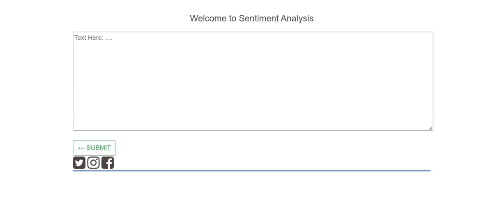

# Sentiment Analysis App 

Sentiment analysis, an important area in Natural Language Processing, is the process of automatically detecting an opinion or feelings about something using data like text or images, regarding almost anything. 

Sentiment analysis is widely applied to voice-of-customer materials such as product reviews on online shopping websites like Amazon, movie reviews, or social media. It can be just a basic task of classifying the polarity of a text as being positive/negative or it can go beyond polarity, looking at sentiment states.

It helps companies in their decision-making process. Imagine the task of determining whether a product’s review is positive or negative; you could do it yourself just by reading it, right? But what about 2k, 10k, and 100k? Are you pretending to read all those and manually classify them? Let’s be honest, your job would be the worst ever. There is where Sentiment Analysis comes in.

There are many sources of public sentiment e.g. public interviews, surveys, etc. However, with more and more people joining social media platforms, websites like Facebook and Twitter can be parsed for public sentiment.

Also, there exist several ways to implement Sentiment Analysis and each data scientist has his/her preferred method, here you will find a very simple one so you can understand what it involves. This repository contains:

- Jupyter Notebook with an introduction to sentiment analysis and a case study on Twitter US Airline.

- App project of Sentiment Analysis. It returns the percentage of positive, negative, and neutral sentiment characteristics of a given text written in english. It is specifically attuned to sentiments expressed in social media. 

```diff
- This is a development app. Do not use it in a production deployment.
```

**MADE WITH**: 
[]()
[]()

# Directory Tree

```bash
.
├── data
│   ├── USAirlinesTweets.sqlite
├── notebooks
│   ├── USAirlinesTweets.ipynb
├── static
│   └── style.css
│   ├── usage.gif
└── templates
    ├── home.html
    └── sentiment.html
├── .gitignore
├── app.py
├── README.md
├── requirements.txt
├── utils.py


4 directories, 11 files
```

# Prerequisites

- Python 3

# Getting Start

1. Clone this repo

2. Go to the dir project

3. Install requirements

```bash
pip install -r requirements.txt
```

4. Run Flask App

```bash
python -m flask run
```

5. Visite http://127.0.0.1:5000/ on Internet Browser



# Contact

For questions, please contact:

- e-mail: julianac.araujo@br.ey.com
